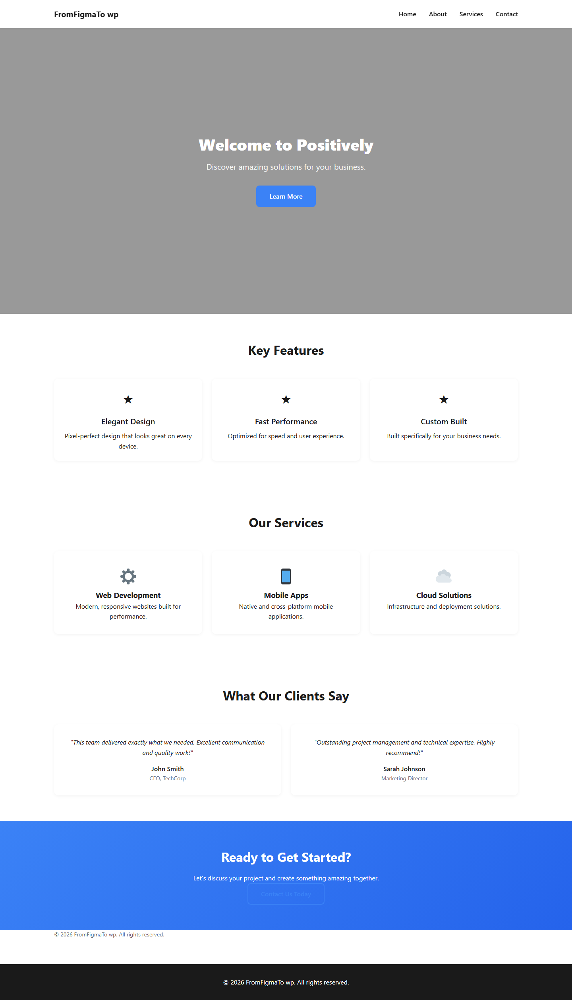
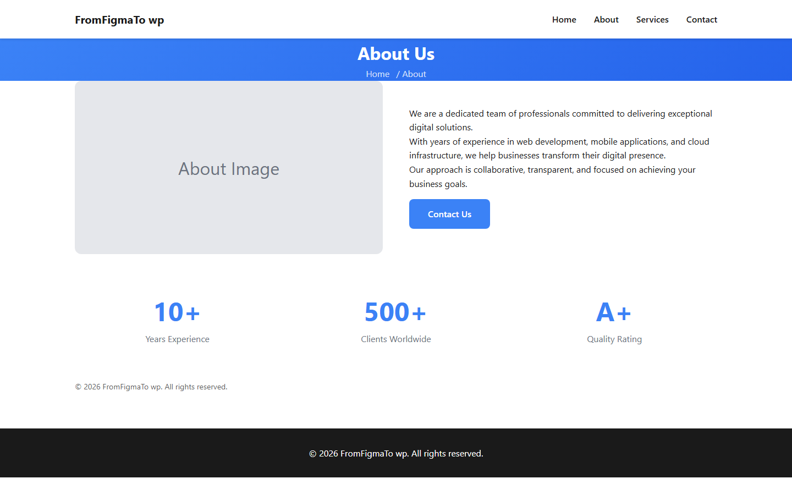
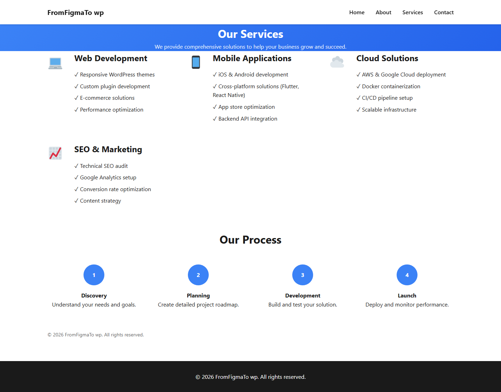
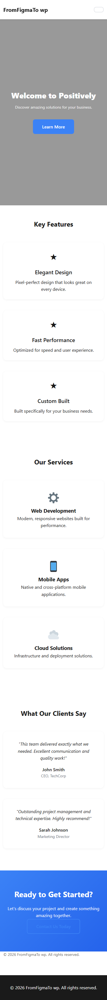

# Positively — Figma to WordPress Conversion

A custom WordPress theme hand-built from a Figma landing-page design: pixel-aware layout, fully responsive, manageable from wp-admin via ACF + Customizer — no page builder required.



## What this demonstrates

- **Design-to-theme workflow** — Figma sections (hero, features, services, testimonials, CTA, inner pages) mapped 1:1 to template parts.
- **Content management** — every section editable via ACF field groups (hero copy, features repeater, services repeater, testimonials, contact settings).
- **Theme customization** — colors, social links, footer text and logo via the WordPress Customizer.
- **Responsive + RTL** — mobile (320px), tablet (768px), desktop (1024px+) breakpoints plus `rtl.css` for Arabic layouts.
- **Clean WordPress standards** — escaping/sanitization throughout, text domain `positively`, no hard-coded content.

## Pages

| Page | Template | Screenshot |
|------|----------|------------|
| Home (static front page) | `front-page.php` → `template-parts/front-page.php` | above + mobile below |
| About | `page.php` → `template-parts/page-about.php` |  |
| Services | `page.php` → `template-parts/page-services.php` |  |
| Contact | `page.php` → `template-parts/page-contact.php` | — |
| Blog / single post | `index.php` / `single.php` + `content-*.php` fallbacks | — |

### Mobile



## ACF field groups

| Group | Location |
|-------|----------|
| Hero Section (title, subtitle, CTA, background) | Front page |
| Features (title + repeater) | Front page |
| Services (title + repeater) | Front page |
| Testimonials (repeater) | Front page |
| Contact Settings (recipient, subject, success message) | Pages |

All templates ship with sensible fallback content, so the theme renders even before ACF fields are filled.

## Requirements

- WordPress 6.0+
- PHP 8.1+ (verified on 8.2)
- MySQL 8.0+ / MariaDB
- [Advanced Custom Fields](https://wordpress.org/plugins/advanced-custom-fields/) (free version is enough)

## Install (local, e.g. XAMPP)

```bash
# 1. Copy the theme into your site
cp -r positively-landing <site>/wp-content/themes/

# 2. WordPress admin
# Plugins → install & activate "Advanced Custom Fields"
# Appearance → Themes → activate "Positively Landing Page"

# 3. Content setup
# Pages → create Home, About, Services, Contact
# Settings → Reading → static homepage = Home
# Appearance → Menus → new menu on "Primary" location
# Settings → Permalinks → Post name
```

## Project structure

```
positively-landing/
├── style.css            # Theme header + design system
├── rtl.css              # RTL overrides
├── functions.php        # Setup, menus, enqueues, ACF blocks
├── front-page.php       # Static front page entry
├── header.php / footer.php / sidebar hooks
├── index.php / page.php / single.php / searchform.php
├── template-parts/
│   ├── front-page.php   # Hero + features + services + testimonials + CTA
│   ├── page-about.php / page-services.php / page-contact.php
│   └── content-{page,post,single,none}.php
├── inc/
│   ├── acf-fields.php       # Local field group registration
│   ├── customizer.php       # Colors, social, footer settings
│   └── template-{tags,functions}.php
├── css/main.min.css / js/main.min.js
└── screenshots/         # Showcase captures (docs only)
```

## Notes

- Developed and verified on XAMPP (Apache + MySQL) with pretty permalinks.
- No live public demo URL — screenshots above are captured from the local build. To preview: follow *Install* and open the homepage.

© 2026 Positively. All rights reserved.
